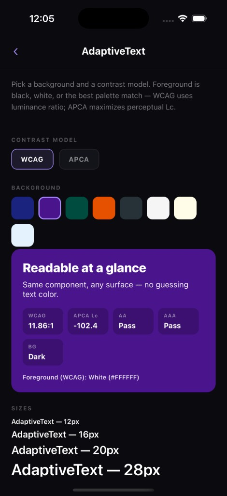
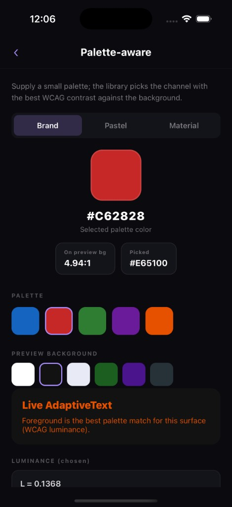
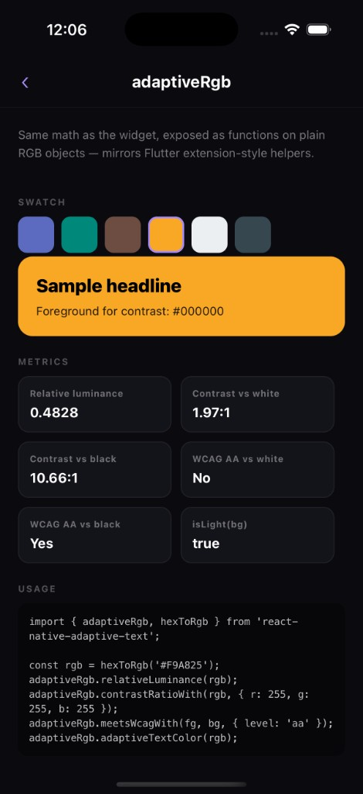
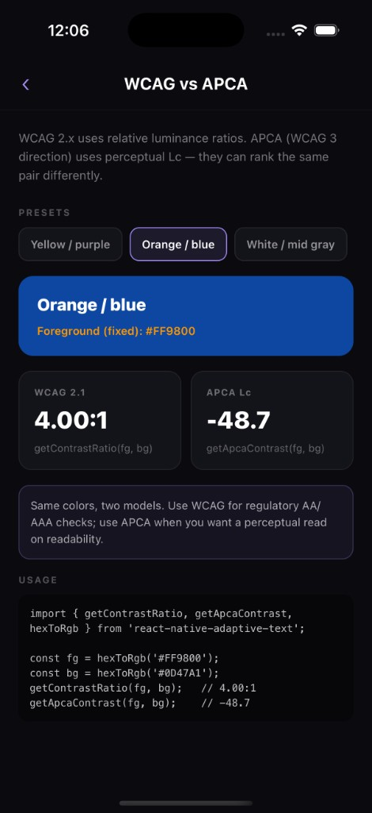

# react-native-adaptive-text

[](https://www.npmjs.com/package/react-native-adaptive-text)
[](https://github.com/iuzairaslam/react-native-adaptive-text/blob/main/LICENSE)
[](https://www.typescriptlang.org/)
[](https://reactnative.dev)


Ever put text on a colored card and realize it’s **hard to read**, or you keep flipping between white and black by hand? **react-native-adaptive-text** does that thinking for you.

You give it the **background color** (and optionally a small list of **brand colors**). It picks a **text color** that stays readable, usually black or white, or whichever brand color scores best. Under the hood it uses the same kind of **contrast math** accessibility guidelines rely on (WCAG 2.1 luminance, plus optional **APCA**). You don’t need to be an accessibility expert to use it.

The library is **pure JavaScript/TypeScript**—no native modules, no extra `pod install` for this package—so it works in typical **React Native** and **Expo** setups the same way.


## Why people reach for it

* **Fewer “oops, can’t read that” moments** on banners, buttons, chips, and colored headers.
* **Brand friendly:** you’re not locked to only black and white; pass a palette and let the best option win.
* **Keeps RN simple:** one import, **`AdaptiveText`** as a drop-in **`Text`**, optional **`AdaptiveTextTheme`** so you don’t repeat `backgroundColor` on every line.
* **Icons and custom `Text` too** via **`useAdaptiveForegroundColor`**, not only paragraphs—so the whole tile can match.


## Try the demo (see it on screen)

If you already use React Native, open a terminal in this repo’s **`example`** folder and run:

```bash
cd example
npm install
npx pod-install   # iOS only, first time
npm run android
# or
npm run ios
```

You’ll get a small sample app that walks through the main ideas (widget demo, palette, extension-style helpers, APCA)—no need to wire anything up first.

<table>
  <tr>
    <th align="center">AdaptiveText widget</th>
    <th align="center">Palette aware</th>
    <th align="center">Color helpers (`adaptiveRgb`)</th>
    <th align="center">APCA algorithm</th>
  </tr>
  <tr>
    <td align="center" valign="top"></td>
    <td align="center" valign="top"></td>
    <td align="center" valign="top"></td>
    <td align="center" valign="top"></td>
  </tr>
</table>

**Image slots (same layout as `flutter_adaptive_text`):** add these files next to this README under **`assets/`**:

| File | Role |
|------|------|
| `assets/readme_banner.png` | Wide cover under the badges |
| `assets/demo_adaptive_text_widget.png` | Column 1 |
| `assets/demo_palette_aware.png` | Column 2 |
| `assets/demo_color_extension.png` | Column 3 |
| `assets/demo_apca.png` | Column 4 |


## Use it in your own app

**1.** Add the package:

```bash
npm install react-native-adaptive-text
# or
yarn add react-native-adaptive-text
```

**2.** Import once:

```tsx
import { AdaptiveText } from 'react-native-adaptive-text';
```

**3.** Swap a line of text for something that “knows” the background:

```tsx
<AdaptiveText backgroundColor="#1a237e" style={{ fontSize: 18 }}>
  Hello
</AdaptiveText>
```

That’s the happy path: the package chooses a foreground that tends to read well on that background. An explicit **`style.color`** still wins if you set it.

**Optional: your brand colors instead of only black/white**

```tsx
<AdaptiveText
  backgroundColor="#000000"
  palette={['#ff9800', '#eeeeee', '#ffeb3b']}
>
  Sale ends today
</AdaptiveText>
```

**Optional: set the background once for a whole section**

```tsx
import { AdaptiveTextTheme, AdaptiveText } from 'react-native-adaptive-text';

<AdaptiveTextTheme backgroundColor={cardColor} algorithm="wcag">
  <AdaptiveText style={{ fontWeight: '700' }}>Title</AdaptiveText>
  <AdaptiveText>Subtitle</AdaptiveText>
</AdaptiveTextTheme>
```

You need **React Native ≥ 0.71** and **React ≥ 18**. Run **`npm run build`** in the library root once if you install from a **`file:`** path so **`dist/`** exists (see **Development** below).


## A note for designers and product folks

This package answers: **“What color should the letters be so people can actually read them?”**  
It does **not** replace a full design system, pick gradients for you, or read colors out of a photo. It works with **solid `ColorValue`s** you already chose for UI surfaces (and respects an explicit text color when you set one).


## Want the full technical map?

Types, exports, WCAG/APCA details, hooks, and parity with **`flutter_adaptive_text`** are documented in the sections below and in the source on GitHub:

* [Repository & README source](https://github.com/iuzairaslam/react-native-adaptive-text)  
* [npm package page](https://www.npmjs.com/package/react-native-adaptive-text) (when published)


## License & source

MIT. See [LICENSE](https://github.com/iuzairaslam/react-native-adaptive-text/blob/main/LICENSE).

Repository: [github.com/iuzairaslam/react-native-adaptive-text](https://github.com/iuzairaslam/react-native-adaptive-text)


---

## Detailed documentation

Table of contents

- [Why this library?](#why-this-library)
- [Features](#features)
- [Architecture](#architecture)
- [Requirements](#requirements)
- [Installation](#installation)
- [Theme and overrides](#theme-and-overrides)
- [Standalone math and color helpers](#standalone-math-and-color-helpers)
- [Hooks](#hooks)
- [Context API](#context-api)
- [Types](#types)
- [Flutter API parity](#flutter-api-parity)
- [Development](#development)
- [Platform notes](#platform-notes)

### Why this library?

- **Accessible contrast by default**: foreground is chosen from luminance and WCAG-style contrast (or APCA when you opt in).
- **Zero native setup**: works on **iOS and Android** with the same JS bundle—no `pod install` for this package, no Android Gradle changes, no autolinking.
- **Composable**: use **`AdaptiveText`** as a drop-in **`Text`**, or wrap subtrees with **`AdaptiveTextTheme`** so you do not repeat `backgroundColor` on every line.
- **Explicit color wins**: if you set **`style.color`**, it is respected (same rule as the Flutter widget).

### Features

- **`AdaptiveText`**: `Text` with automatic foreground from `backgroundColor` and/or theme.
- **`AdaptiveTextTheme`**: provide `backgroundColor`, optional `palette`, and `algorithm` (`wcag` | `apca`) for descendant **`AdaptiveText`** and hooks.
- **Hooks**: **`useAdaptiveForegroundColor`** for **`TextInput`**, icons, or custom **`Text`**; **`useAdaptiveTextTheme`** to read the current theme.
- **Core helpers**: luminance, contrast ratio, WCAG checks, APCA, **`getAdaptiveColor`** on **`Rgb`**, and React Native **`ColorValue`** → hex utilities.
- **Optional palette**: choose the best color from a brand list instead of only black/white.
- **Shipped as `dist/` for `main`**: Metro still resolves **`"react-native": "src/index.ts"`** for local development against the repo.

### Architecture

| Layer | Role |
|--------|------|
| **`algorithm.ts`** | Pure **sRGB** math: luminance, WCAG contrast, APCA, **`getAdaptiveColor`**, **`meetsWcag`**, **`isLight` / `isDark`**. No `react-native` import. |
| **`colorUtils.ts`** | **`ColorValue`** parsing, hex helpers, **`adaptiveTextHex`**, style introspection for explicit **`color`**. |
| **`AdaptiveTextTheme.tsx`** | React context: **`AdaptiveTextTheme`**, **`useAdaptiveTextTheme`**. |
| **`AdaptiveText.tsx`** | Composes theme + utils and renders **`Text`**. |
| **`useAdaptiveForegroundColor.ts`** | Same resolution rules as **`AdaptiveText`**, returns a **hex** string for non-**`Text`** use cases. |

Nothing in this tree registers native view managers or TurboModules: it is **JS-only**, suitable for Expo and bare React Native alike.

### Requirements

- **React Native**: ≥ 0.71  
- **React**: ≥ 18  
- **iOS**: ≥ 13 (typical RN baseline)  
- **Android**: API ≥ 21  

> **No native modules** for this library: no `pod install` changes, no Android application edits, and no linking steps.

### Installation

#### npm (recommended)

```bash
npm install react-native-adaptive-text
```

#### GitHub Packages (optional)

Use only if you consume the package from **GitHub Packages** under a scoped name (for example **`@iuzairaslam/react-native-adaptive-text`**).

```bash
npm login --scope=@iuzairaslam --auth-type=legacy --registry=https://npm.pkg.github.com
npm install @iuzairaslam/react-native-adaptive-text
```

#### Local path (monorepo or sibling folder)

```json
"react-native-adaptive-text": "file:../react-native-adaptive-text"
```

Run **`npm run build`** in the library root once so **`dist/`** exists. Metro resolves **`react-native`** to **`src/index.ts`** for local development.

### Theme and overrides

```tsx
import { AdaptiveTextTheme, AdaptiveText } from 'react-native-adaptive-text';

export function Card() {
  return (
    <AdaptiveTextTheme backgroundColor="#1a237e" algorithm="wcag">
      <AdaptiveText style={{ fontWeight: '700' }}>Title</AdaptiveText>
      <AdaptiveText>Subtitle</AdaptiveText>
    </AdaptiveTextTheme>
  );
}
```

#### Palette + APCA

```tsx
import { AdaptiveText, ContrastAlgorithm } from 'react-native-adaptive-text';

const brand = ['#ff9800', '#eeeeee', '#ffeb3b'];

export function BrandLine() {
  return (
    <AdaptiveText
      backgroundColor="#000000"
      palette={brand}
      algorithm={ContrastAlgorithm.apca}
    >
      Brand text
    </AdaptiveText>
  );
}
```

### Standalone math and color helpers

```ts
import {
  getAdaptiveColor,
  getLuminance,
  meetsWcag,
  rgbToHex,
} from 'react-native-adaptive-text';

const bg = { r: 26, g: 35, b: 126 };
const rgb = getAdaptiveColor(bg);
const hex = rgbToHex(rgb);
```

```ts
import { adaptiveTextHex, colorValueToRgb } from 'react-native-adaptive-text';

adaptiveTextHex('#1a237e');
adaptiveTextHex('rgb(0,0,0)', { palette: ['#ff0', '#fff'] });
```

```ts
import { adaptiveRgb } from 'react-native-adaptive-text';

adaptiveRgb.adaptiveTextColor({ r: 0, g: 0, b: 0 });
adaptiveRgb.contrastRatioWith({ r: 0, g: 0, b: 0 }, { r: 255, g: 255, b: 255 });
```

### Hooks

```tsx
import { Text } from 'react-native';
import {
  useAdaptiveForegroundColor,
  AdaptiveTextTheme,
} from 'react-native-adaptive-text';

function Subtitle() {
  const color = useAdaptiveForegroundColor();
  return <Text style={{ color }}>Using theme</Text>;
}

export function Screen() {
  return (
    <AdaptiveTextTheme backgroundColor="#333">
      <Subtitle />
    </AdaptiveTextTheme>
  );
}
```

### Context API

```tsx
import { useAdaptiveTextTheme } from 'react-native-adaptive-text';

const theme = useAdaptiveTextTheme();
// theme is AdaptiveTextThemeData | null
// { backgroundColor, palette?, algorithm }
```

### Types

```ts
import type { ColorValue, TextProps } from 'react-native';

type ContrastAlgorithm = 'wcag' | 'apca';

interface Rgb {
  r: number;
  g: number;
  b: number;
}

interface AdaptiveTextThemeData {
  backgroundColor: ColorValue;
  palette?: ColorValue[] | null;
  algorithm: ContrastAlgorithm;
}

interface AdaptiveTextProps extends TextProps {
  backgroundColor?: ColorValue;
  palette?: ColorValue[] | null;
  algorithm?: ContrastAlgorithm;
}
```

### Flutter API parity

| Flutter | React Native |
|--------|----------------|
| `getLuminance` | `getLuminance` |
| `getContrastRatio` | `getContrastRatio` |
| `getAdaptiveColor` | `getAdaptiveColor` |
| `getApcaContrast` | `getApcaContrast` |
| `isLight` / `isDark` | `isLight` / `isDark` |
| `meetsWcag` | `meetsWcag` |
| `ContrastAlgorithm` | `ContrastAlgorithm` |
| `AdaptiveText` | `AdaptiveText` |
| `AdaptiveTextTheme` | `AdaptiveTextTheme` |
| `BuildContext` extension | `useAdaptiveForegroundColor`, `useAdaptiveTextTheme` |
| `Color` extension | `adaptiveRgb`, `adaptiveTextHex`, `colorValueToRgb` |

### Development

```bash
npm install
npm run build    # emits dist/
npm test         # library unit tests
npm run test:all # library + example tests
npm run typescript   # tsc --noEmit
```

### Platform notes

- Works on **iOS** and **Android** with the same JavaScript API.
- No optional native peer dependencies for this package.
